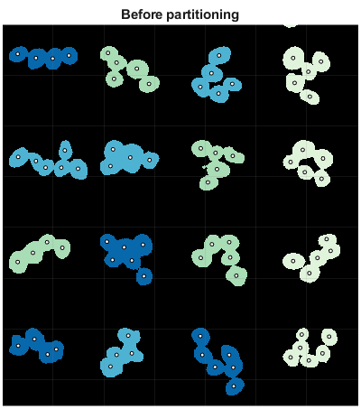
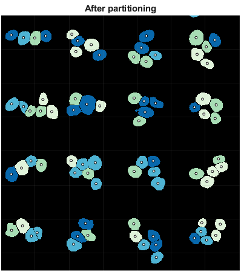

# Geometric partitioning
A geometric method of partitioning partially overlapping nuclei (or other convex objects) using seed-points.

The figure below gives a graphical overview of the method. Each boundary vertex is assigned to the best seed-point. Additionally, triangle graphs are searched for and used to create another possible set of cuts. The cuts with the highest score (largest overlap with image edges or edge normals that line up) are used. Cuts are the optimized over a small region.


## Installation

1. Download the repository.
2. Open Matlab on your computer, and change the current folder to the downloaded repository.
3. Run `setup.m`. This function will
    * Add the necessary files to your Matlab path.
    * Attempt to compile two C functions that will increase the program speed. If a C compiler is not found on your computer, then the code will still run, but it could be slower.
4. Start by browsing the examples located in the `examples/` folder.


#### Installation Notes
* The GitHub repository could take a few minutes to download as the repository is ~200 MB. The majority of this space comes from the example data included.
* `setup.m` will not permanently add the files to your Matlab path. If you want the files to remain on your Matlab path, the run the command `savepath` in the Matlab command window after running `setup.m`.

## Requirements

* Matlab version R2016b or higher.
* The Image Processing Toolbox.
* The Statistics and Machine Learning Toolbox.
* The Parallel Computing Toolbox - _This toolbox is optional, but this code is **significantly** faster with a GPU._

## Example usage
Use geometric partitioning to partition clumps of nuclei using the true nuclei centers.

#### Load image, mask, and seed-points
```Matlab
I = imread('image_67.tif');
BW = imread('mask_67.tif');
r0 = load_truth('67');
```

#### Create the partition options
```Matlab
partOptions = partitionOptions();
partOptions.Minimum_Hole_Size = 10;
partOptions.Use_GPU = 1;
```

#### Partition objects and plot results
```Matlab
[BW_partitioned, cuts, Info] = partition_objects(I, BW, r0, partOptions);
plot_partition_results(BW_partitioned, r0, [700, 1970; 1450, 2670])
```


